# Family Feud

Overview:

A Node JS web application utilizing its own API to run and host Family Feud games.

## Project Organization
| Page | Description |
|------|-------------|
| **Landing Page** | The landing page allows users to join an existing game or create their own:<br>- Providing an existing game's public code and clicking "Join Game" will take them the "Game" page with the provided public code applied to the URL.<br>- Clicking "Create Game" will take them to the "Create Game" page. |
| **Create Game** | Form page that accepts names for:<br>- the game<br>- each of the two teams<br>- all members on each team.<br><br>Clicking "Create Game" triggers:<br>- creation of the game<br>- registering the user as the host<br>- opens the "Game" page with the appropriate public code applied to the URL. |
| **Game** | The primary page of the application. Displays the current state of a game:<br>- the question<br>- any already identified answers<br>- scores<br>- the team in control<br>- active players.<br><br>If the user is the host for the round, they will:<br>- have additional game controls<br>- be able to see the "hidden" answers for the question|

## Capstone Requirements Fulfilled
| Requirement | Implementation |
|-------------|----------------|
| **Analyze data that is stored in arrays, objects, sets or maps and display information about it in your app.** | - A game and its state is a larger JSON object with is manipulated in a host of ways.<br>-The final state is displayed appropriately on screen.|
| **Calculate and display data based on an external factor (ex: get the current date, and display how many days remaining until some event)** | - Timer is implimented by storing the timer end date time in UTC on the game file. Then calculating and displaying the number of seconds between that future time and now. |
| **Persist important data to the user to local storage and make the stored data accessible in your app. (including after reload/refresh).** | - The secret host code is stored on game creation to session storage.<br>- It is then retrieved and sent in all calls to the API to "authenticate" the user as the host, allowing for the various actions. |
| **Create a node.js web server using Express.js.** | - Created node.js web server with Express.js to host the internal API for interacting with the game file. Both for the host and the player. |
| **Create an API that implements HTTP requests for GET and POST. Data can be stored in a JSON file on the back-end** | - Created a robust API with multiple methods for retrieving and manipulating various parts of a game file.<br> -Data is stored in a JSON file on the server. |
| **At least one media query to make your site responsive** | - The "Game" and "Create Game" pages both have media queries to organize how content is displayed for phone/tablet sized devices and then desktops.<br> - On the "Game" page, this media query also results in changing which elements display on screen. |

## How to Download
1. **Clone the repo using GIT**
```bash
git clone https://github.com/kirk-c-saunders/family-feud.git
```
2. **Navigate to the project directory**
```bash
cd family-feud
```

3. **Install dependencies**
```bash
npm install
```

4. **Create environment variables file**
Create a file named `.env` in the project root directory with the following content:
```env
PORT=8080
```
6. **Start the server**
```bash
npm run dev
```

7. **Access the application**
Open your browser and navigate to: http://localhost:8080

## Use Guide
### Creating a Game
From the landing page:
1. Click "Create Game". You will be redirect to a screen like below: 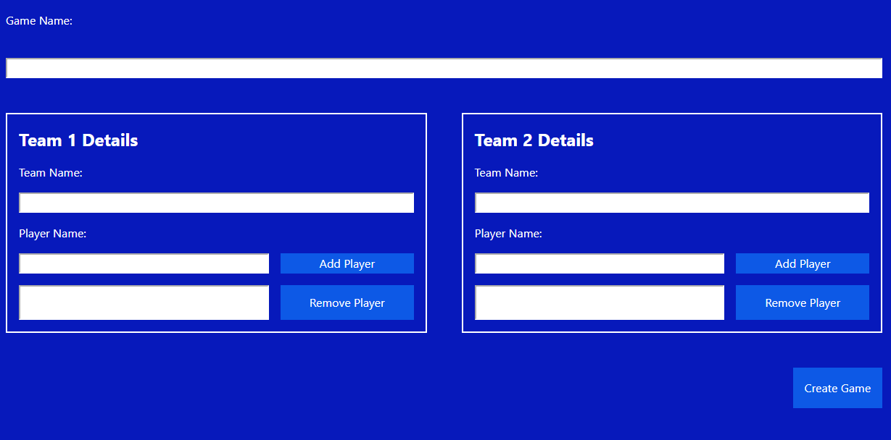
1. Fill out the "Game Name" and "Team Name" fields. 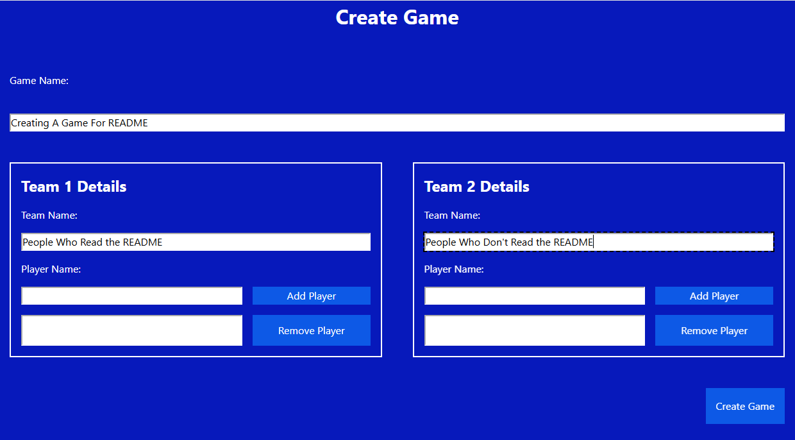
1. Players are added to each team by providing a single player to the team's "Add Player" text box, then clicking "Add Player". 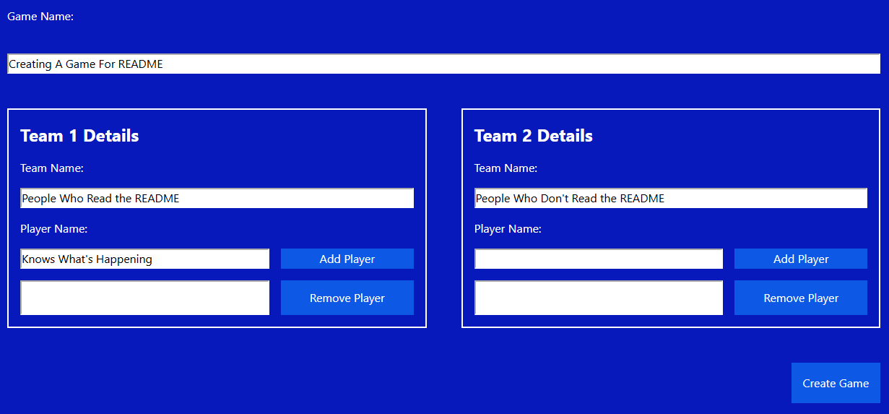 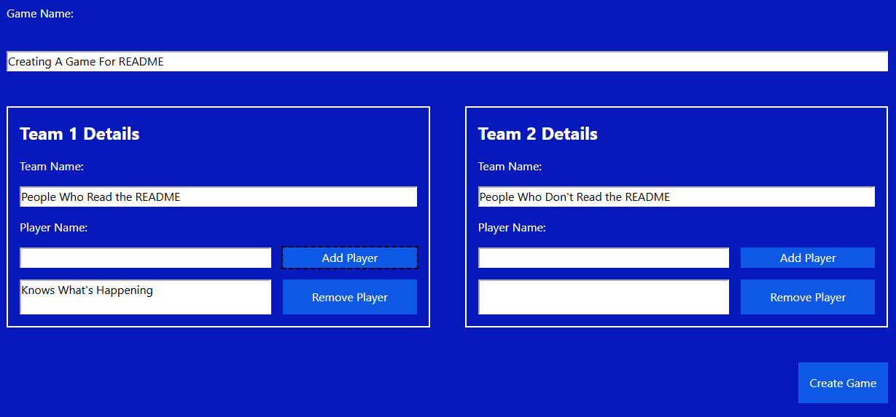
1. Repeat for as many players as needed for each team.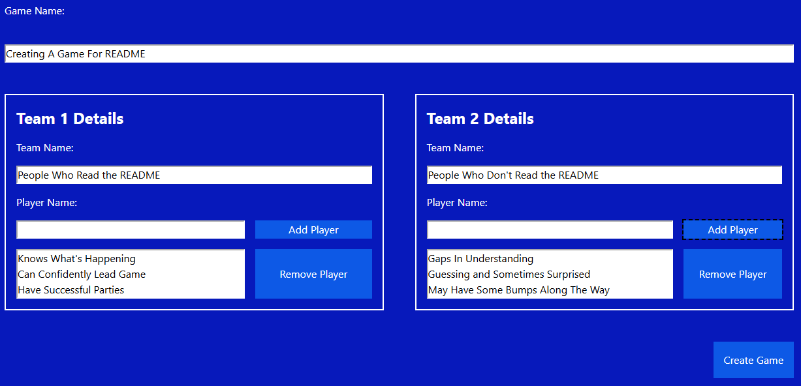
1. Clicking "Remove Player" removes the bottom player from the list.
1. Click "Create Game" to create the game and automatically direct yourself to the game. The URL or the code in the URL can be shared for others to join the game.

### Running a Game - Host Controls
1. When loading a game initially (assuming the game public code in the URL is valid and you are the host), a page like below will load. 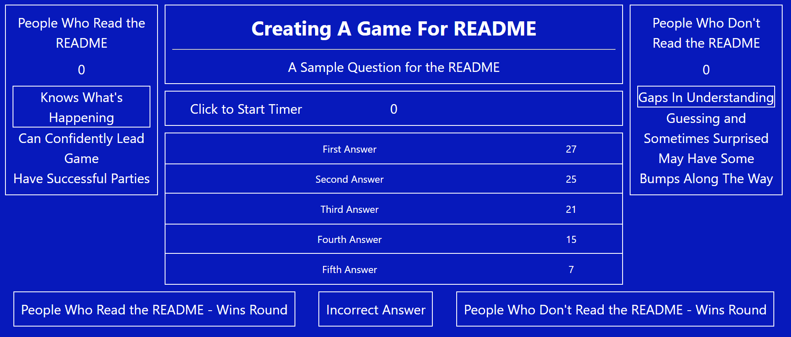
1. First identify the team that is "In Control" by clicking on their team name/score/players box. There will be a gradient background change when it is hovered over, and the background will change to a lighter blue once clicked. 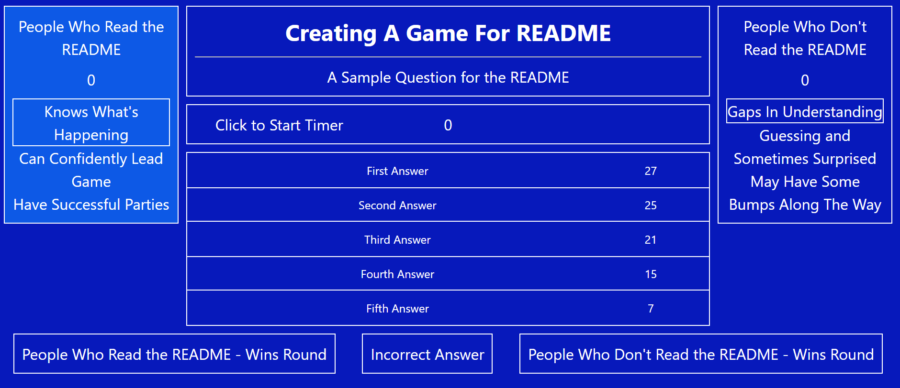 (the team "In Control" can be changed at any time by clicking on the team who is not "In Control")
1. Next start the timer by clicking "Click to Start Timer". This will trigger the 45 second time to start. The timer can be reset at any time by clicking on it again. 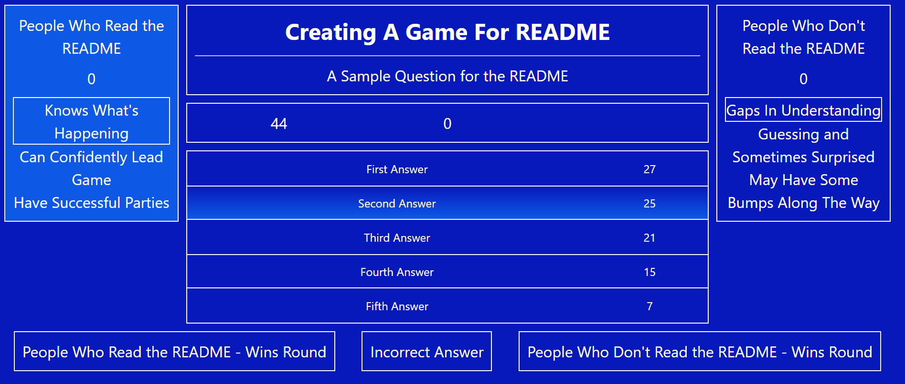
1. Now the game is ready to accept answers from the team in control.
#### Accepting Answers
1. If the answer is correct, simply click on the answer. Its background will change to a light blue, indicating it is "On" and displayed to all non-host players with the game loaded. 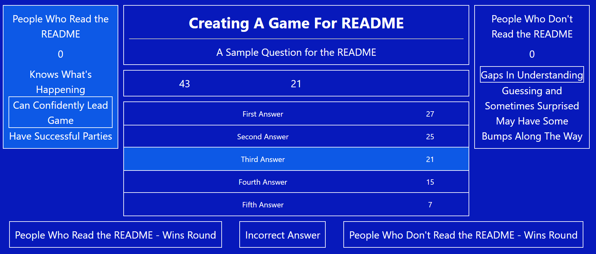 It will also: be added into the round score (in the same box as the timer), update the "active" player for the "In Control" team to the next player and reset the timer.
1. If an incorrect answer is given, simply click on the "Incorrect Answer" button. It will add a `X` on the right side of the box with the timer, reset the timer and update the "active" player for the "In Control" team to the next player. 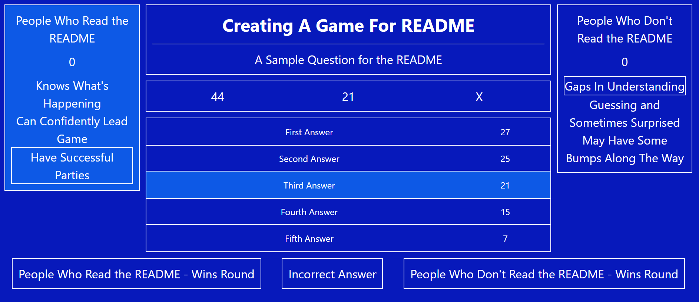
1. In the event an answer is mistakenly revealed, it can be re-hidden by clicking on it again. Restoring the original color, moving the "active" player on the team "In Control" back 1, and removing the answer from the round score. It will not reset the timer.
1. If 3 incorrect responses are given, the team "In Control" will automatically switch over to the other team, to support the final answer on potential steals. 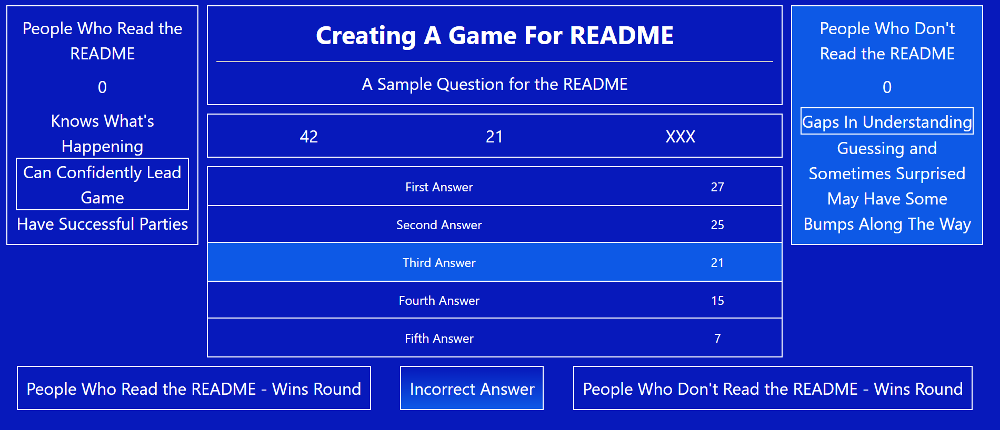
#### Ending a Round
The round ends when either:
1. All answers have been correctly guessed.
1. 3 incorrect answers have been given, and the final "steal" answer has been given

Once either action has occured, the team who won the round, and gets the points, needs their "[Team Name] - Wins Round" Button clicked.

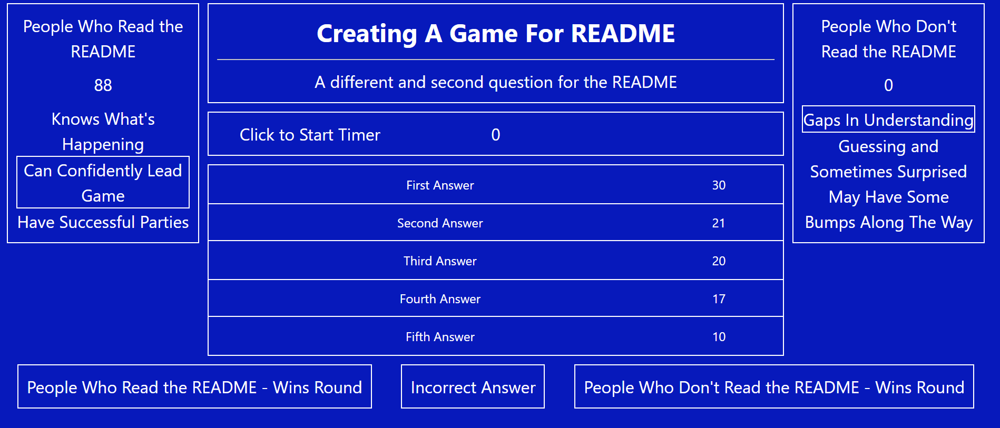

This action will:
1. Apply the points for the round to the total score for that team
1. Get a new question for the next round
1. Stop the timer
1. Make neither team the team "In Control"
1. Reset the Incorrect Response Count

### Playing a Game - Player View
The Player view is just like the Host view, however the buttons on the bottom are missing and they only get to see the revealed answers. (Host on the left, player on the right) 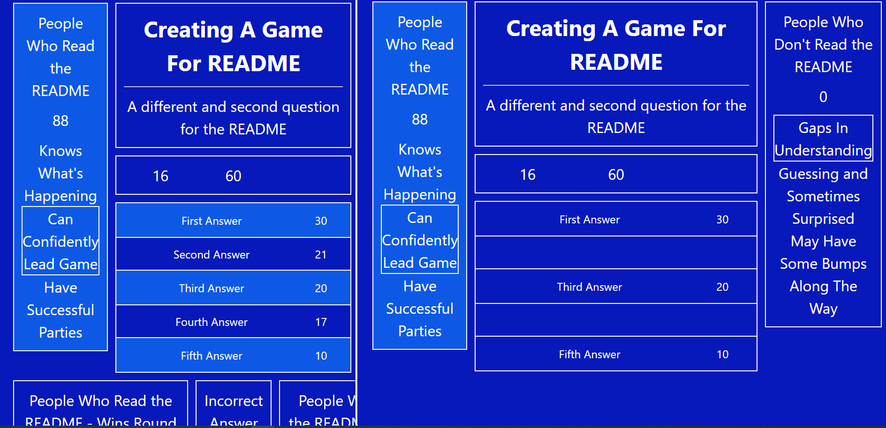

The player's page refreshes automatically every 1.5 seconds, so they can stay in sync with what is happening in the game without needing to manage any manual page refreshes.